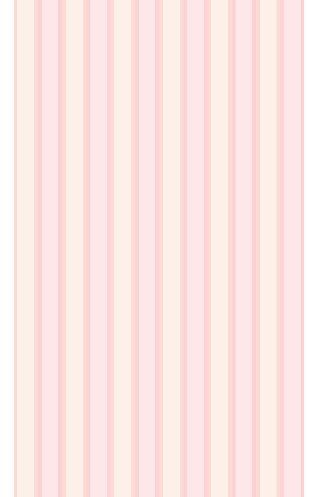
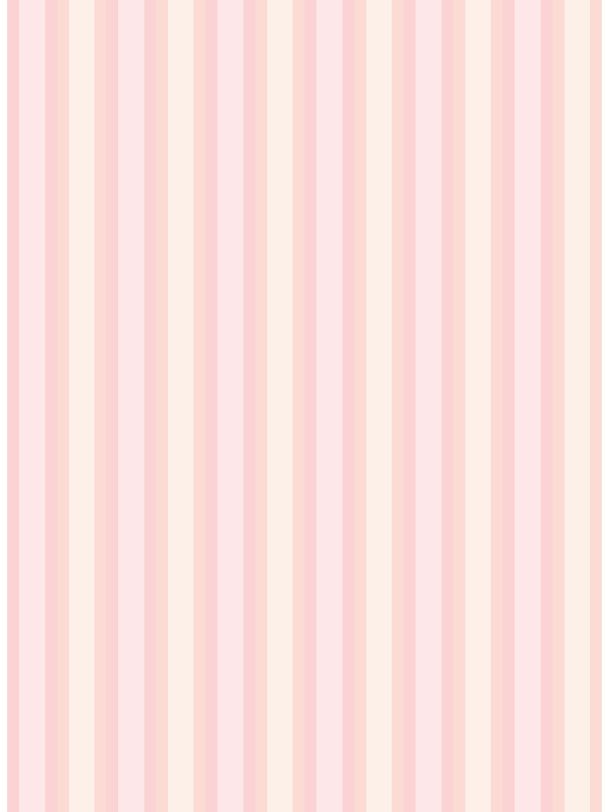

Bootstrap Responsive Grid Illustrator Template
==============================================

##Grid options
See how aspects of the Bootstrap grid system work across multiple devices with a handy table.

|Devices|SmartPhone|Tablets 768px|Medium Desktop|Large Desktop|
|---|---|---|---|---|
| Container | width	None (auto) |	750px	| 970px	| 1170px |
| Class prefix |	.col-xs- |	.col-sm-	| .col-md- |	.col-lg- |
| Column width | Auto	|  ~62px 	| ~81px |	~97px |
| Gutter width	| 30px (15px on each side of a column) |

##Media queries
We use the following media queries in our Less files to create the key breakpoints in our grid system.

```css

/* Extra small devices (phones, less than 768px) */
/* No media query since this is the default in Bootstrap */

/* Small devices (tablets, 768px and up) */
@media (min-width: @screen-sm-min) { ... }

/* Medium devices (desktops, 992px and up) */
@media (min-width: @screen-md-min) { ... }

/* Large devices (large desktops, 1200px and up) */
@media (min-width: @screen-lg-min) { ... }

```

##Artbords

###Large-devices-Desktops-1200px


###Medium-devices-Desktops-1024px


###Small-devices-Tablets-768px


###Extra-small-devices-Phones-480px


###Extra-small-devices-Phones-320px


